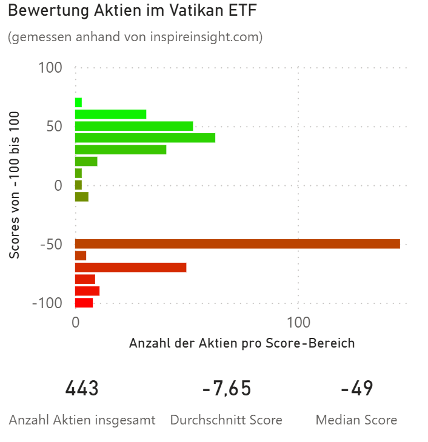

# ETF Evaluation Webscraper

**Erhalte Inspire Impact Scores für alle Aktien in einem ETF und visualisiere die Score-Verteilung.**



Dieses Repository stellt alles bereit, was du brauchst, um:

- Eine CSV mit den Aktiensymbolen (Tickern) eines beliebigen ETFs einzulesen (`input_tickers.csv`).
- Die Inspire Impact Scores für diese Ticker mittels des enthaltenen Python-Skripts von inspireinsight.com abzufragen.
- Eine Ergebnis-CSV (z.B. `inspire_scores_20260305.csv`) zu erhalten, bereit für weitere Analyse oder Visualisierung.
- Eine Power BI-Visualisierung der Score-Verteilung zu sehen oder nachzubauen (`visualization/score_distribution.png`).

---

## Schnellstart

1. **Ticker vorbereiten:** Bearbeite `input_tickers.csv` mit den gewünschten ETF-Bestandteilen (Beispiel ist enthalten).
2. **Scraper ausführen:**
   ```bash
   pip install -r requirements.txt
   playwright install
   python fetch_inspire_scores.py
   ```
   Das Ergebnis wird als CSV mit Datum gespeichert (`inspire_scores_YYYYMMDD.csv`).
3. **Visualisieren:** Lade die Ergebnis-CSV in Power BI (oder Excel o.ä.) und analysiere die "Inspire Impact Scores". Beispiel siehe `visualization/score_distribution.png`.

---

## Dateien & Struktur

- `input_tickers.csv` — Eingabe: Liste der ETF-Aktienticker & Namen
- `inspire_scores_*.csv` — Ausgabe: Aktien, Namen & deren Inspire Impact Scores
- `fetch_inspire_scores.py` — Python3-Skript zum Scrapen der Scores
- `requirements.txt` — Abhängigkeiten für die schnelle Installation
- `visualization/` — Enthält das Power BI-Bild und Dokumentation zur Score-Verteilung

---

## Über die Daten

- **Eingabe:** Beliebige ETF-Aktienliste (hier: ein katholischer ETF, anonymisiert zur Wahrung der Privatsphäre)
- **Scraping:** Inspire Impact Scores quantifizieren die „biblische Kompatibilität“ jedes Unternehmens, wie auf inspireinsight.com definiert.
- **Ausgabe:** CSV mit Tickern, Firmennamen und Scores (-100 = am wenigsten kompatibel, +100 = am kompatibelsten)

---

## Autor

Daten, Skripting und Visualisierung von [BenBitang](https://github.com/BenBitang)

---

*Dieses Projekt dient nur zu Bildungs- und Demonstrationszwecken. Es handelt sich nicht um eine Anlageberatung.*
