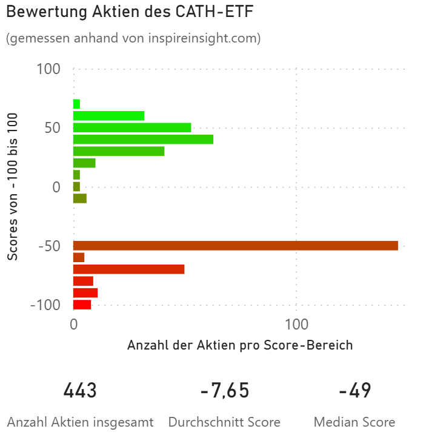

# ETF Aktien Bewertung mithilfe von Webscraping

## Dateien & Struktur

- `input_tickers.csv` — Eingabe: Liste der ETF-Aktienticker & Namen
- `inspire_scores_*.csv` — Ausgabe: Aktien, Namen & deren Inspire Impact Scores
- `fetch_inspire_scores.py` — Python3-Skript zum Scrapen der Scores
- `requirements.txt` — Abhängigkeiten für die schnelle Installation
- `visualization/` — Enthält das Power BI-Bild und Dokumentation zur Score-Verteilung

## Funktionsweise

1. benötigte libraries aus requirements.txt herunterladen (z.B. mithilfe von pip)
2. Aktien eines ETFs zusammen mit deren Ticker in eine .csv Datei eintragen
3. in fetch_inspire_scores.py den Pfad der .csv eingeben
4. fetch_inspire_scores.py ausführen
5. Output: .csv Datei mit den Aktienscores von inspireinsight.com

## Hintergrund und Erklärung des Scores

inspireinsight.com ist eine Seite, die Aktien ethisch bewertet.
Dabei kriegen Unternehmen mit guten Arbeitsbedingungen einen positiven Score bis zu 100,
während schlechte Unternehmen mit fraglicher Ethik mit einer negativen Zahl bis zu -100 gekennzeichnet werden.

Beispiel einer solchen ETF-Aktien-Analyse anhand des globalen CATH-ETF:

